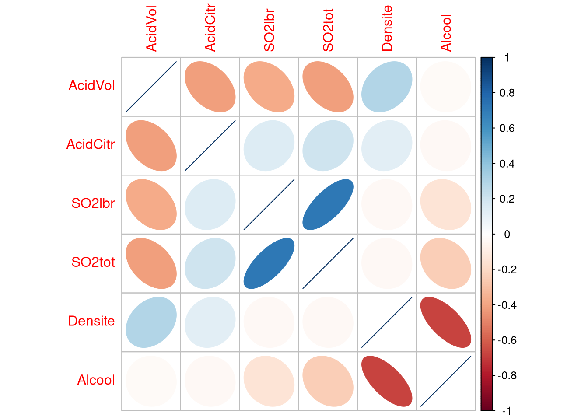

# Stats - Covariance et corrélation

Mesurer la liaison linéaire entre deux variables quantitatives, et visualiser toute la matrice des corrélations.

## Formules

La covariance est la généralisation bidimensionnelle de la variance :

$$Cov(\underline{x},\underline{y}) = \frac{1}{n} \sum_{i=1}^n (x_i-\bar{x}) (y_i -\bar{y})$$

La corrélation linéaire est la covariance renormalisée par les écarts-type :

$$cor(\underline{x},\underline{y}) = \frac{Cov(\underline{x},\underline{y})}{\sqrt{s_x^2\ \ s_y^2}}$$

## Pourquoi la corrélation plutôt que la covariance

La covariance dépend des unités de mesure des deux variables, donc sa valeur n'est pas interprétable seule. La corrélation est sans unité et vit dans $[-1,1]$, ce qui permet de comparer des couples de variables entre eux.

Même piège que pour `var()` : `cov()` renvoie la version **corrigée** en $1/(n-1)$, pas la formule ci-dessus en $1/n$. `cor()` n'est pas concerné, la renormalisation fait disparaître le diviseur.

```r
cov(Data$Alcool, Data$Densite)   # divise par n-1, pas par n
cor(Data$Alcool, Data$Densite)   # dans [-1, 1]
cov(Data[, -c(1:2)])             # matrice de covariance, sans Qualite ni Type
cor(Data[, -c(1:2)])             # matrice de correlation
```

| Argument | Effet |
| --- | --- |
| `x` de `cov` et `cor` | vecteur, ou matrice et data frame pour obtenir la matrice complète |
| `y` | le second vecteur, à omettre si `x` est une matrice |
| `use = "complete.obs"` | ne garde que les lignes sans valeur manquante |
| `method` de `cor` | `"pearson"` par défaut, sinon `"spearman"` ou `"kendall"` |

Attention, `Data[, -c(1:2)]` retire les deux premières colonnes `Qualite` et `Type` qui sont qualitatives.

## Matrice des corrélations avec corrplot

```r
library(corrplot)
corrplot(cor(Data[, -c(1:2)]), method = "ellipse")
```



Une ellipse étirée et fine signale une corrélation forte, un cercle signale une corrélation proche de 0. La couleur donne le signe.

| Valeur de `method` | Effet |
| --- | --- |
| `"ellipse"` | ellipses dont la forme et l'inclinaison codent la corrélation, celle du TP |
| `"circle"` | cercles dont le diamètre code l'intensité, valeur par défaut |
| `"square"` | carrés dont la taille code l'intensité |
| `"color"` | cases pleines colorées |
| `"shade"` | cases colorées avec hachures |
| `"number"` | valeurs numériques écrites dans les cases |
| `"pie"` | camemberts partiellement remplis |

## Lien avec la régression

Une corrélation proche de -1 entre `Densite` et `Alcool` se lit comme un nuage aligné sur une droite de pente négative.

## Voir aussi

- [ggplot2 - Nuage de points et régression](ggplot2%20-%20Nuage%20de%20points%20et%20r%C3%A9gression.md)
- [Stats - Indices de position et de dispersion](Stats%20-%20Indices%20de%20position%20et%20de%20dispersion.md)
- [Stats - Liaison quantitative qualitative](Stats%20-%20Liaison%20quantitative%20qualitative.md)
- [Stats - Table de contingence](Stats%20-%20Table%20de%20contingence.md)
- [Dataviz - Quel graphique pour quel type de variable](Dataviz%20-%20Quel%20graphique%20pour%20quel%20type%20de%20variable.md)
- [Dataviz - Démarche d'exploration d'un jeu de données](Dataviz%20-%20D%C3%A9marche%20d%27exploration%20d%27un%20jeu%20de%20donn%C3%A9es.md)
- [R - Data frames](R%20-%20Data%20frames.md)
- [R - Aide-mémoire des fonctions](R%20-%20Aide-m%C3%A9moire%20des%20fonctions.md)
