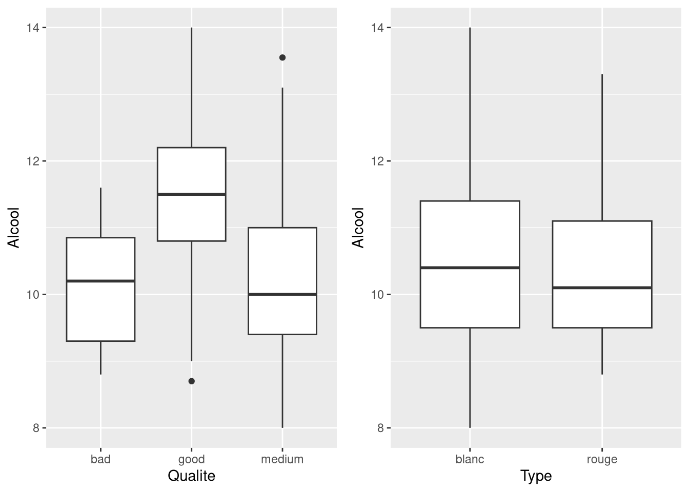

# Stats - Liaison quantitative qualitative

Mesurer l'influence d'une variable qualitative $X$ sur une variable quantitative $Y$, par exemple `Qualite` ou `Type` sur `Alcool`.

## Notations

$X$ prend $J$ modalités $m_1, \ldots, m_J$. On note $C_j=\{i\in\{1,\ldots,n\}; x_i=m_j\}$ l'ensemble des individus prenant la modalité $m_j$, et $n_j$ son cardinal.

## Décomposition de la moyenne

La moyenne de $\underline{y}$ est la moyenne pondérée des moyennes conditionnelles :

$$\bar{y} = \frac{1}{n} \sum_{j=1}^J n_j\ \bar{y}_{[j]} \textrm{   avec   } \bar{y}_{[j]} = \frac{1}{n_j} \sum_{i\in C_j} y_i$$

## Décomposition de la variance

$$s_y^2 = \underbrace{s_{y,E}^2}_{\textrm{variance inter-classe}} + \underbrace{s_{y,R}^2}_{\textrm{variance intra-classe}}$$

$$s_{y,E}^2 = \frac{1}{n} \sum_{j=1}^J n_j\ (\bar{y}_{[j]} - \bar{y})^2$$

$$s_{y,R}^2 = \frac{1}{n} \sum_{j=1}^J n_j\ s_{y,[j]}^2 \textrm{ avec } s^2_{y,[j]} = \frac{1}{n_j}\sum_{i\in C_j} (y_i - \bar{y}_{[j]})^2$$

La variance inter-classe mesure l'écartement des moyennes de groupe, la variance intra-classe mesure la dispersion à l'intérieur des groupes.

## Rapport de corrélation

$$\rho_{y|x} = \sqrt{\frac{s_{y,E}^2}{s_{y}^2}} = \sqrt{1 - \frac{s_{y,R}^2}{s_{y}^2}}\in[0,1]$$

Plus $\rho_{y|x}$ est proche de $0$, plus $s_{y,E}^2$ est proche de 0, et donc moins la variable qualitative $X$ a d'influence sur la variable quantitative $Y$. À l'inverse une valeur proche de 1 signale des groupes bien séparés.

## Boxplots conditionnels

```r
g1 <- ggplot(Data, aes(x = Qualite, y = Alcool)) +
  geom_boxplot()
g2 <- ggplot(Data, aes(x = Type, y = Alcool)) +
  geom_boxplot()
grid.arrange(g1, g2, ncol = 2)
```



| Argument | Effet |
| --- | --- |
| `x` de `aes` | la variable qualitative, une boîte par modalité |
| `y` de `aes` | la variable quantitative dont on voit la distribution |
| `ncol` de `grid.arrange` | nombre de colonnes de la grille de graphiques |

Des boîtes décalées verticalement indiquent une liaison, des boîtes au même niveau indiquent un $\rho_{y|x}$ proche de 0.

## Moyennes par groupe avec tapply

```r
tapply(Data$Alcool, Data$Qualite, mean)   # moyennes conditionnelles y_[j]
tapply(Data$Alcool, Data$Type, mean)
tapply(Data$Alcool, Data$Qualite, var)    # variances par groupe
```

| Argument | Effet |
| --- | --- |
| `X` | le vecteur quantitatif à résumer |
| `INDEX` | le facteur qui définit les groupes |
| `FUN` | la fonction appliquée dans chaque groupe |

## Voir aussi

- [ggplot2 - Boxplot](ggplot2%20-%20Boxplot.md)
- [Stats - Indices de position et de dispersion](Stats%20-%20Indices%20de%20position%20et%20de%20dispersion.md)
- [Stats - Quantiles et écart interquartile](Stats%20-%20Quantiles%20et%20%C3%A9cart%20interquartile.md)
- [Stats - Variable qualitative - effectifs et fréquences](Stats%20-%20Variable%20qualitative%20-%20effectifs%20et%20fr%C3%A9quences.md)
- [Stats - Covariance et corrélation](Stats%20-%20Covariance%20et%20corr%C3%A9lation.md)
- [Stats - Table de contingence](Stats%20-%20Table%20de%20contingence.md)
- [Dataviz - Quel graphique pour quel type de variable](Dataviz%20-%20Quel%20graphique%20pour%20quel%20type%20de%20variable.md)
- [R - Famille apply](R%20-%20Famille%20apply.md)
- [R - Aide-mémoire des fonctions](R%20-%20Aide-m%C3%A9moire%20des%20fonctions.md)
