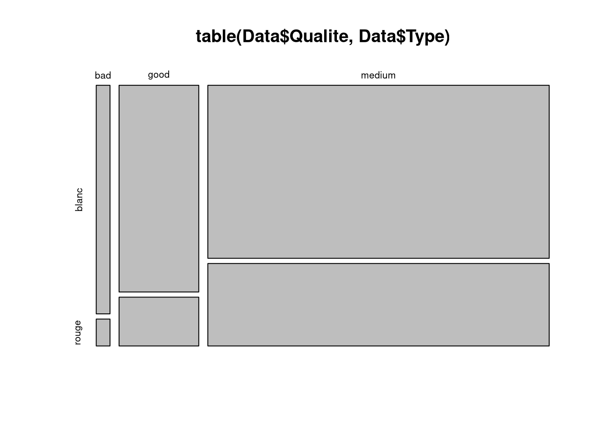

# Stats - Table de contingence

Étudier l'influence de deux variables qualitatives entre elles, ici `Qualite` et `Type`.

## Formules

$X$ prend $J$ modalités $m_1,\ldots,m_J$ et $Y$ prend $K$ modalités $\ell_1,\ldots,\ell_K$. La table de contingence est l'ensemble des effectifs conjoints :

$$n_{j,k} = \sum_{i=1}^n \mathrm{1}_{x_i = m_j\ \cap\ y_i=\ell_k},\ \ \forall j\in\{1,\ldots,J\},\ \forall k\in\{1,\ldots,K\}$$

Les effectifs marginaux sont les sommes par ligne et par colonne :

$$n_{j,.}=\sum_{k=1}^K n_{j,k}\ \ \ \textrm{   et   } \ \ \ n_{.,k}=\sum_{j=1}^J n_{j,k}$$

## Le code du TP

```r
table.cont = table(Data$Qualite, Data$Type)
table.cont
```

| Argument | Effet |
| --- | --- |
| premier argument de `table` | la variable en lignes |
| second argument | la variable en colonnes |
| `useNA = "ifany"` | ajoute une ligne et une colonne pour les valeurs manquantes |

## Profils-lignes et profils-colonnes

Le profil-ligne $j$ est la distribution de $Y$ chez les individus de modalité $m_j$ :

$$\left(\frac{n_{j,1}}{n_{j,.}},\ldots,\frac{n_{j,K}}{n_{j,.}}\right)\in [0,1]^K$$

Le profil-colonne $k$ est la distribution de $X$ chez les individus de modalité $\ell_k$ :

$$\left(\frac{n_{1,k}}{n_{.,k}},\ldots,\frac{n_{J,k}}{n_{.,k}}\right)\in [0,1]^J$$

Si tous les profils-lignes se ressemblent, les deux variables sont sans influence l'une sur l'autre.

```r
prop.table(table.cont, margin = 1)   # profils-lignes, chaque ligne somme a 1
prop.table(table.cont, margin = 2)   # profils-colonnes, chaque colonne somme a 1
```

| Argument | Effet |
| --- | --- |
| `x` de `prop.table` | la table d'effectifs |
| `margin = 1` | divise par les totaux de ligne |
| `margin = 2` | divise par les totaux de colonne |
| `margin` omis | divise par l'effectif total $n$ |

## Mosaicplot

```r
mosaicplot(table(Data$Qualite, Data$Type))
mosaicplot(table(Data$Type, Data$Qualite))
```



L'ordre des arguments de `table()` change le graphique. La première variable donne les bandes principales et la seconde le découpage à l'intérieur, donc les deux appels ne montrent pas la même lecture des profils.

| Argument | Effet |
| --- | --- |
| `x` de `mosaicplot` | la table de contingence à représenter |
| `main` | titre du graphique |
| `color` | remplit les cases en couleur |
| `shade = TRUE` | colore selon les résidus par rapport à l'indépendance |

## Voir aussi

- [Stats - Variable qualitative - effectifs et fréquences](Stats%20-%20Variable%20qualitative%20-%20effectifs%20et%20fr%C3%A9quences.md)
- [Stats - Liaison quantitative qualitative](Stats%20-%20Liaison%20quantitative%20qualitative.md)
- [Stats - Covariance et corrélation](Stats%20-%20Covariance%20et%20corr%C3%A9lation.md)
- [ggplot2 - Barplot et camembert](ggplot2%20-%20Barplot%20et%20camembert.md)
- [Dataviz - Quel graphique pour quel type de variable](Dataviz%20-%20Quel%20graphique%20pour%20quel%20type%20de%20variable.md)
- [Dataviz - Démarche d'exploration d'un jeu de données](Dataviz%20-%20D%C3%A9marche%20d%27exploration%20d%27un%20jeu%20de%20donn%C3%A9es.md)
- [R - Data frames](R%20-%20Data%20frames.md)
- [R - Aide-mémoire des fonctions](R%20-%20Aide-m%C3%A9moire%20des%20fonctions.md)
