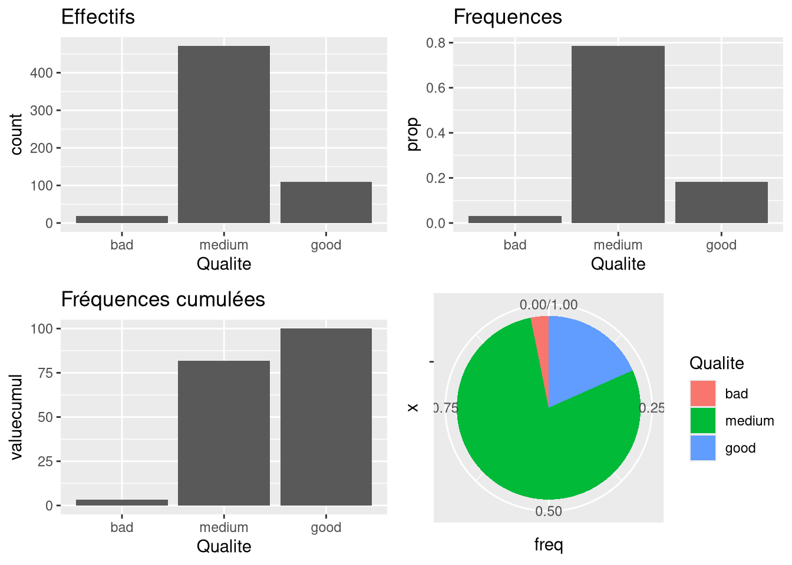

# Stats - Variable qualitative - effectifs et fréquences

Décrire une variable qualitative par ses effectifs et ses fréquences, avec `Type` et `Qualite` du jeu de données `Data`.

## Formules

Pour une variable $X$ à $K$ modalités $m_1, \ldots, m_K$ observée $n$ fois, l'effectif de la modalité $m_k$ est

$$n_k = \sum_{i=1}^{n} \mathbb{1}_{x_i = m_k}$$

et la fréquence est $f_k = \frac{n_k}{n}$, donc $\sum_{k=1}^{K} f_k = 1$.

Pour une variable ordinale on ajoute les effectifs et fréquences cumulés :

$$N_k = \sum_{\ell=1}^{k} n_\ell \qquad F_k = \sum_{\ell=1}^{k} f_\ell$$

## Nominale ou ordinale

| Variable | Nature | Modalités |
| --- | --- | --- |
| `Type` | qualitative nominale, pas d'ordre naturel | blanc, rouge |
| `Qualite` | qualitative ordinale, les modalités s'ordonnent | bad, medium, good |

## Déclarer la variable comme facteur

```r
Data$Qualite = as.factor(Data$Qualite)
Data$Type = factor(Data$Type, labels = c("blanc", "rouge"))
levels(Data$Type)            # "blanc" "rouge"
length(levels(Data$Type))    # nombre K de modalites
```

| Argument | Effet |
| --- | --- |
| `x` de `as.factor` | vecteur converti en facteur, niveaux déduits des valeurs |
| `labels` de `factor` | renomme les niveaux dans l'ordre, ici 0 devient blanc et 1 devient rouge |
| `levels` de `factor` | impose la liste et l'ordre des niveaux |

## Effectifs et fréquences

```r
summary(Data$Type)                      # effectifs par modalite
EffType = as.vector(table(Data$Type))   # meme chose, sans les noms
EffType
Freq = EffType / length(Data$Type)      # frequences f_k
```

Sur un facteur, `summary()` renvoie les effectifs et non les six indices numériques. `as.vector()` retire les noms de la table pour obtenir un simple vecteur.

## Cumuls pour une variable ordinale

```r
EffQual = as.vector(table(Data$Qualite))
FreqQual = data.frame(Eff = EffQual,
                      Freq = EffQual / length(Data$Qualite),
                      FreqCumul = cumsum(EffQual) / length(Data$Qualite))
rownames(FreqQual) = levels(Data$Qualite)
```

| Fonction | Effet |
| --- | --- |
| `cumsum(x)` | sommes cumulées successives de `x` |
| `prop.table(table(x))` | convertit une table d'effectifs en table de fréquences |

```r
100 * cumsum(prop.table(table(Data$Qualite)))   # frequences cumulees en pourcentage
```

## Ordonner les modalités avec forcats

Par défaut R classe les niveaux par ordre alphabétique, ce qui donne bad, good, medium. `fct_relevel()` remet l'ordre voulu.

```r
Qualite_rec <- fct_relevel(Data$Qualite, "bad", "medium", "good")
```

| Argument | Effet |
| --- | --- |
| `.f` de `fct_relevel` | le facteur à réordonner |
| `...` | les niveaux cités dans l'ordre souhaité, ils passent en tête |

## Tableau de sortie avec kable

```r
knitr::kable(data.frame(modalite = levels(Data$Type),
                        Eff = EffType,
                        Freq = Freq),
             caption = 'Description de la variable Type',
             booktabs = TRUE,
             digits = 3)
```

| Argument | Effet |
| --- | --- |
| `x` | le data frame à mettre en tableau |
| `caption` | titre du tableau |
| `digits` | nombre de décimales affichées |
| `booktabs` | mise en forme des filets du tableau |

## Représentations graphiques



Effectifs, fréquences, fréquences cumulées et camembert de `Qualite`. Les fréquences cumulées n'ont de sens que parce que la variable est ordinale.

## Voir aussi

- [ggplot2 - Barplot et camembert](ggplot2%20-%20Barplot%20et%20camembert.md)
- [Stats - Table de contingence](Stats%20-%20Table%20de%20contingence.md)
- [Stats - Liaison quantitative qualitative](Stats%20-%20Liaison%20quantitative%20qualitative.md)
- [Stats - Indices de position et de dispersion](Stats%20-%20Indices%20de%20position%20et%20de%20dispersion.md)
- [Dataviz - Quel graphique pour quel type de variable](Dataviz%20-%20Quel%20graphique%20pour%20quel%20type%20de%20variable.md)
- [Dataviz - Démarche d'exploration d'un jeu de données](Dataviz%20-%20D%C3%A9marche%20d%27exploration%20d%27un%20jeu%20de%20donn%C3%A9es.md)
- [R - Data frames](R%20-%20Data%20frames.md)
- [R - Aide-mémoire des fonctions](R%20-%20Aide-m%C3%A9moire%20des%20fonctions.md)
