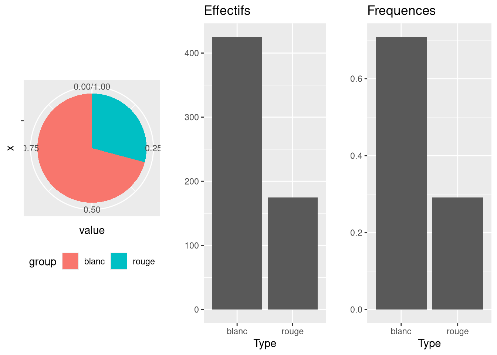

# ggplot2 - Barplot et camembert

Représenter une variable qualitative par ses effectifs ou ses fréquences.

## geom_bar compte tout seul

On ne donne que `x`, `geom_bar()` compte les observations de chaque modalité. Il ne faut donc pas calculer les effectifs avant, sauf si on veut imposer les hauteurs.

```r
g1 <- ggplot(Data, aes(x = Type)) +
  geom_bar() + ylab("") +
  ggtitle("Effectifs")
g2 <- ggplot(Data, aes(x = Type)) +
  geom_bar(aes(y = (..count..)/sum(..count..))) +
  ylab("") + ggtitle("Frequences")
```

`..prop..` donne directement les fréquences, pour une variable ordinale comme pour une nominale.

```r
ggplot(Data) +
  geom_bar(aes(x = Qualite, y = ..prop.., group = 1)) +
  ggtitle("Frequences") + xlab("Qualite")
```

## Les écritures possibles

| Écriture | Ce qui est tracé |
| --- | --- |
| `geom_bar()` | les effectifs $n_k$, comptés par ggplot2 |
| `geom_bar(aes(y = (..count..)/sum(..count..)))` | les fréquences $f_k = n_k/n$ |
| `geom_bar(aes(y = ..prop.., group = 1))` | les fréquences aussi, `group = 1` force le calcul sur tout l'échantillon |
| `geom_bar(stat = "identity")` | les hauteurs déjà calculées et fournies dans `y` |

## Camembert

Un camembert est un barplot empilé tracé en coordonnées polaires. Il faut donc une seule barre, donnée par `x = ""`, remplie par la variable qualitative.

```r
quan <- as.vector(table(Data$Type))/nrow(Data)
df <- data.frame(group = levels(Data$Type), value = quan)
ggplot(df, aes(x = "", y = value, fill = group)) +
  geom_bar(width = 1, stat = "identity") +
  coord_polar("y", start = 0) +
  theme(legend.position = "bottom")
```



| Argument | Effet |
| --- | --- |
| `width = 1` | la barre occupe toute la largeur, sinon le camembert a un trou |
| `stat = "identity"` | utilise les fréquences déjà calculées dans `value` |
| `coord_polar("y", start = 0)` | enroule l'axe des y en cercle |
| `fill` | la variable qui découpe les parts |

Dès qu'il y a plus de deux ou trois modalités, le diagramme en bâtons se lit mieux que le camembert, parce que l'oeil compare des longueurs bien plus facilement que des angles.

## Voir aussi

- [Stats - Variable qualitative - effectifs et fréquences](Stats%20-%20Variable%20qualitative%20-%20effectifs%20et%20fr%C3%A9quences.md)
- [Stats - Table de contingence](Stats%20-%20Table%20de%20contingence.md)
- [ggplot2 - Catalogue des geom](ggplot2%20-%20Catalogue%20des%20geom.md)
- [ggplot2 - Assembler plusieurs graphiques](ggplot2%20-%20Assembler%20plusieurs%20graphiques.md)
- [Dataviz - Quel graphique pour quel type de variable](Dataviz%20-%20Quel%20graphique%20pour%20quel%20type%20de%20variable.md)
