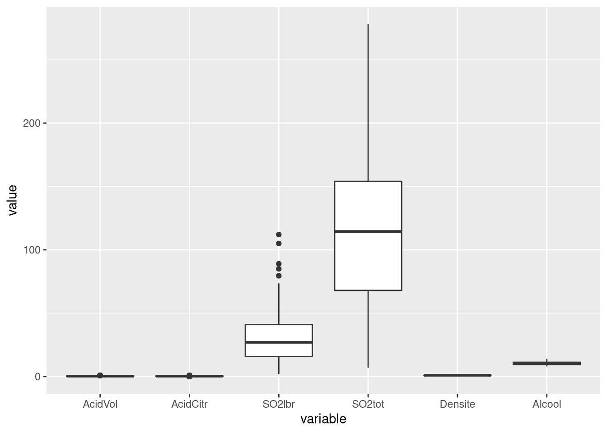
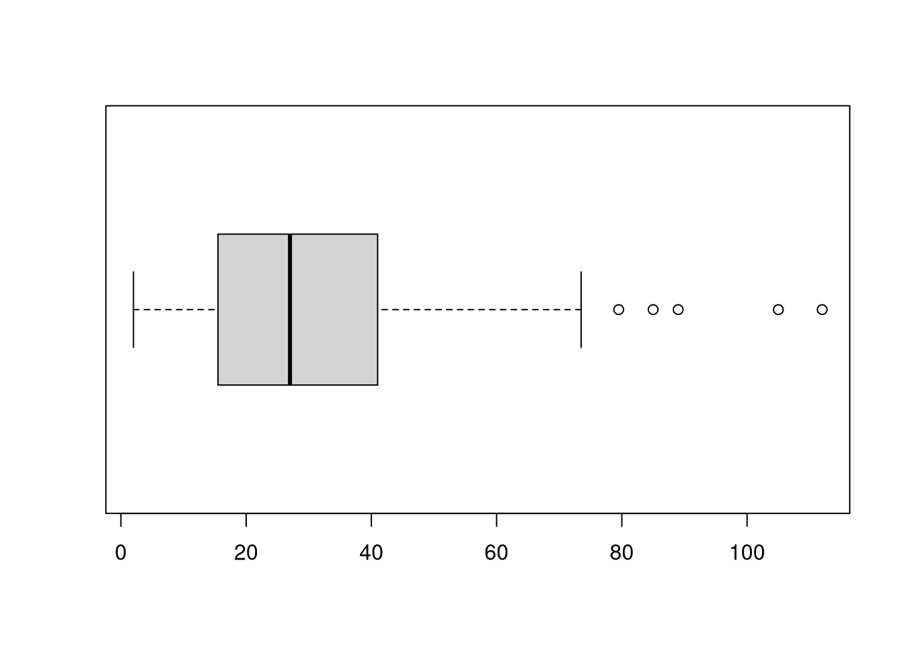

# ggplot2 - Boxplot

Résumer une variable quantitative par ses quartiles et repérer ses valeurs aberrantes.

## Ce que montre la boîte

- les trois quartiles $q_{0.25}$, la médiane $q_{0.5}$ et $q_{0.75}$, qui forment la boîte
- la valeur adjacente supérieure $v^+$, la plus grande valeur de l'échantillon inférieure ou égale à $L^+ = q_{0.75} + 1.5\,IQR$
- la valeur adjacente inférieure $v^-$, la plus petite valeur supérieure ou égale à $L^- = q_{0.25} - 1.5\,IQR$
- les valeurs aberrantes, celles qui n'appartiennent pas à $[v^-, v^+]$, tracées isolément

L'écart interquartile vaut $IQR = q_{0.75} - q_{0.25}$. Les moustaches s'arrêtent sur $v^-$ et $v^+$, pas sur $L^-$ et $L^+$.

## Version ggplot2

```r
ggplot(Data, aes(y = SO2lbr)) +
  geom_boxplot()
```

## Comparer toutes les variables quantitatives

```r
library(reshape2)
ggplot(melt(Data[, -c(1,2)]), aes(x = variable, y = value)) +
  geom_boxplot()
```



`melt()` empile les colonnes en deux colonnes `variable` et `value`, et ce format long est nécessaire parce que `aes()` ne peut mapper qu'une seule colonne sur l'axe des y. Attention, cela ne se lit que si les variables ont des ordres de grandeur comparables, sinon une variable écrase toutes les autres.

## Fonction de base et sortie exploitable

```r
B <- boxplot(Data$SO2lbr, horizontal = TRUE)
attributes(B)
B$stats   # dans l'ordre : v-, q0.25, mediane, q0.75, v+
B$out     # toutes les valeurs aberrantes
Data$SO2lbr[which(Data$SO2lbr < B$stats[1] | Data$SO2lbr > B$stats[5])]
```



| Argument | Effet |
| --- | --- |
| `x` de `boxplot` | le vecteur numérique tracé |
| `horizontal = TRUE` | trace la boîte à l'horizontale |

On vérifie que `B$stats` redonne bien les quantités calculées à la main.

```r
median(Data$SO2lbr)
q <- quantile(x = Data$SO2lbr, probs = c(.25, .75), names = FALSE)
L = q + diff(q) * c(-1.5, 1.5)
min(Data$SO2lbr[Data$SO2lbr >= L[1]])
max(Data$SO2lbr[Data$SO2lbr <= L[2]])
```

## Voir aussi

- [Stats - Quantiles et écart interquartile](Stats%20-%20Quantiles%20et%20%C3%A9cart%20interquartile.md)
- [Stats - Indices de position et de dispersion](Stats%20-%20Indices%20de%20position%20et%20de%20dispersion.md)
- [Stats - Liaison quantitative qualitative](Stats%20-%20Liaison%20quantitative%20qualitative.md)
- [ggplot2 - Catalogue des geom](ggplot2%20-%20Catalogue%20des%20geom.md)
- [ggplot2 - Histogramme et densité](ggplot2%20-%20Histogramme%20et%20densit%C3%A9.md)
- [Dataviz - Démarche d'exploration d'un jeu de données](Dataviz%20-%20D%C3%A9marche%20d%27exploration%20d%27un%20jeu%20de%20donn%C3%A9es.md)
