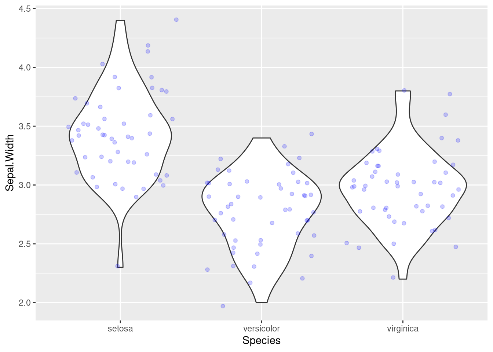

# ggplot2 - Catalogue des geom

Choisir le bon objet géométrique selon les variables que l'on veut représenter.

## Les geom courants

| geom | Sert à | Variables attendues |
| --- | --- | --- |
| `geom_point()` | nuage de points | `x` et `y` quantitatives |
| `geom_line()` | relier les points par des lignes | `x` et `y` quantitatives, `x` ordonnée |
| `geom_bar()` | diagramme en bâtons | `x` qualitative, les effectifs sont comptés |
| `geom_boxplot()` | boîte à moustaches | `y` quantitative, `x` qualitative si on conditionne |
| `geom_violin()` | densité symétrisée par modalité | `x` qualitative et `y` quantitative |
| `geom_histogram()` | histogramme | `x` quantitative |
| `geom_density()` | densité lissée | `x` quantitative |
| `geom_smooth()` | courbe ou droite d'ajustement | `x` et `y` quantitatives |
| `geom_hline()` | ligne horizontale de repère | aucune, on donne `yintercept` |
| `stat_ecdf()`, une stat et non un geom | fonction de répartition empirique | `x` quantitative |

## Superposer deux geom

On ajoute autant de `geom` que voulu avec `+`, ils se dessinent dans l'ordre d'écriture. Ici le violin donne la forme de la distribution et les points montrent les observations réelles.

```r
ggplot(data = iris, aes(x = Species, y = Sepal.Width)) +
  geom_violin() +
   geom_point(col = "blue", alpha = 0.2, position = "jitter")
```



| Argument | Effet |
| --- | --- |
| `col = "blue"` | couleur de tracé fixe, hors de `aes()` |
| `alpha = 0.2` | transparence, 0 invisible et 1 opaque, révèle les points superposés |
| `position = "jitter"` | décale légèrement les points au hasard pour éviter qu'ils se recouvrent |

## Voir aussi

- [ggplot2 - Grammaire de base](ggplot2%20-%20Grammaire%20de%20base.md)
- [ggplot2 - Mappage ou attribut fixe](ggplot2%20-%20Mappage%20ou%20attribut%20fixe.md)
- [ggplot2 - Boxplot](ggplot2%20-%20Boxplot.md)
- [ggplot2 - Histogramme et densité](ggplot2%20-%20Histogramme%20et%20densit%C3%A9.md)
- [ggplot2 - Nuage de points et régression](ggplot2%20-%20Nuage%20de%20points%20et%20r%C3%A9gression.md)
- [ggplot2 - Barplot et camembert](ggplot2%20-%20Barplot%20et%20camembert.md)
- [ggplot2 - Fonction de répartition empirique](ggplot2%20-%20Fonction%20de%20r%C3%A9partition%20empirique.md)
- [Dataviz - Quel graphique pour quel type de variable](Dataviz%20-%20Quel%20graphique%20pour%20quel%20type%20de%20variable.md)
