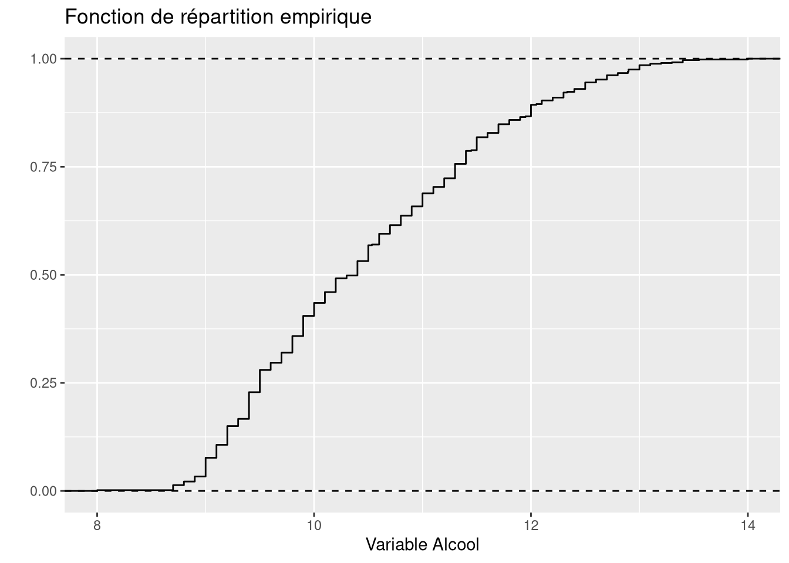

# ggplot2 - Fonction de répartition empirique

Tracer la répartition exacte d'une variable quantitative, sans découpage en classes.

## Définition

La fonction de répartition empirique est la fonction en escalier

$$F_n(t) = \frac{1}{n}\sum_{i=1}^n \mathbb{1}_{x_i \leq t}$$

Elle vaut 0 avant la plus petite observation, 1 après la plus grande, et monte d'un palier de $1/n$ à chaque observation.

## Code

```r
ggplot(Data, aes(Alcool)) +
  stat_ecdf(geom = "step") + xlab("Variable Alcool") +
  ylab("") + ggtitle("Fonction de répartition empirique") +
  geom_hline(yintercept = 0, linetype = "dashed") +
  geom_hline(yintercept = 1, linetype = "dashed")
```



| Argument | Effet |
| --- | --- |
| `geom = "step"` de `stat_ecdf` | trace les vrais paliers, au lieu de relier les sauts en diagonale |
| `yintercept` de `geom_hline` | hauteur de la ligne horizontale de repère |
| `linetype` | style du trait de la ligne |

Les deux `geom_hline()` matérialisent les asymptotes 0 et 1, qui aident à lire le graphique.

## Les linetype utiles

| linetype | Trait |
| --- | --- |
| `"solid"` | plein, valeur par défaut |
| `"dashed"` | tirets |
| `"dotted"` | pointillés |
| `"dotdash"` | alternance point tiret |
| `"longdash"` | tirets longs |
| `"twodash"` | deux tirets de longueurs différentes |

## Quand la préférer

Contrairement à l'histogramme, elle ne dépend d'aucun choix de nombre de classes et montre la répartition exacte. Elle est pratique pour lire un quantile, on cherche la valeur de $t$ telle que $F_n(t)$ atteint l'ordre voulu.

## Voir aussi

- [Stats - Quantiles et écart interquartile](Stats%20-%20Quantiles%20et%20%C3%A9cart%20interquartile.md)
- [ggplot2 - Histogramme et densité](ggplot2%20-%20Histogramme%20et%20densit%C3%A9.md)
- [ggplot2 - Catalogue des geom](ggplot2%20-%20Catalogue%20des%20geom.md)
- [Dataviz - Quel graphique pour quel type de variable](Dataviz%20-%20Quel%20graphique%20pour%20quel%20type%20de%20variable.md)
