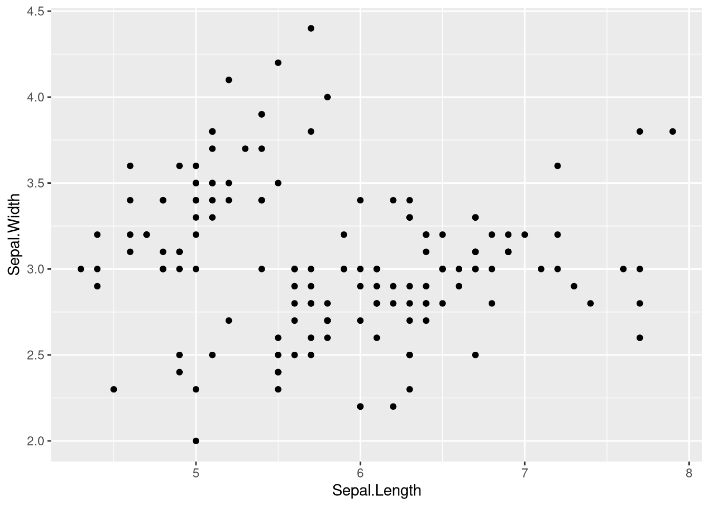

# ggplot2 - Grammaire de base

Comprendre la logique en couches de ggplot2 avant d'écrire le moindre graphique.

## Le principe

Un graphique ggplot2 se construit en empilant des couches avec l'opérateur `+`. La fonction `ggplot()` initialise l'objet et ne dessine rien, ce sont les `geom_*()` qui dessinent.

```r
library(ggplot2)
data(iris)
gEx <- ggplot(data = iris)
summary(gEx)
names(gEx)
gEx$layers   # vide : aucun geom n'a encore ete ajoute
```

L'objet contient déjà les données mais son `layers` est vide, donc rien ne s'affiche.

## Les couches

| Couche | Rôle |
| --- | --- |
| `data` | le tableau de données, un data.frame ou un tibble |
| `aes()` | le mappage, relie les colonnes du tableau aux attributs graphiques |
| `geom_*()` | dessine les objets géométriques, points, barres, boîtes |
| `scale_*()` | règle la façon dont un attribut est lié aux valeurs d'une variable |
| `theme()` | l'apparence générale, fond, grille, position de la légende |
| `labs()` | les intitulés, titre, noms des axes, titre de légende |

## Premier graphique

On ajoute le mappage dans `aes()` puis un `geom`.

```r
ggplot(data = iris, aes(x = Sepal.Length, y = Sepal.Width)) +
   geom_point()
```



## Format des données

ggplot2 exige un data.frame ou un tibble en entrée. Les données doivent être au format long, une ligne par observation et une colonne par variable, car `aes()` désigne des colonnes par leur nom.

## Voir aussi

- [ggplot2 - Mappage ou attribut fixe](ggplot2%20-%20Mappage%20ou%20attribut%20fixe.md)
- [ggplot2 - Catalogue des geom](ggplot2%20-%20Catalogue%20des%20geom.md)
- [ggplot2 - Scales et axes](ggplot2%20-%20Scales%20et%20axes.md)
- [ggplot2 - Assembler plusieurs graphiques](ggplot2%20-%20Assembler%20plusieurs%20graphiques.md)
- [Dataviz - Quel graphique pour quel type de variable](Dataviz%20-%20Quel%20graphique%20pour%20quel%20type%20de%20variable.md)
- [R - Data frames](R%20-%20Data%20frames.md)
