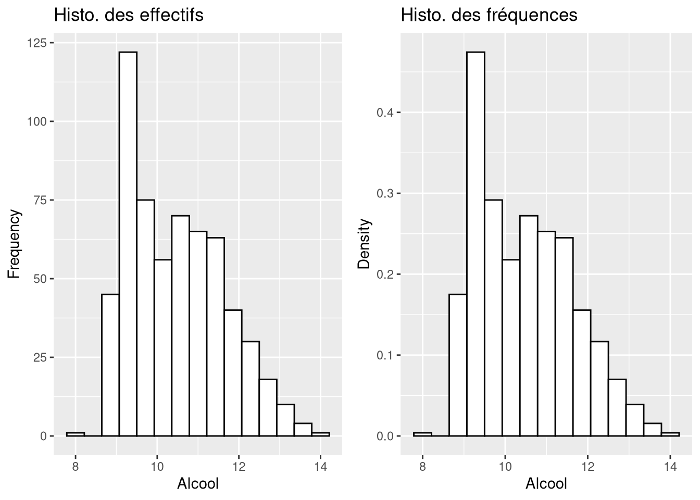

# ggplot2 - Histogramme et densité

Visualiser la forme de la distribution d'une variable quantitative.

## Définition

Les valeurs sont regroupées en intervalles $]a_k, a_{k+1}[$ et la hauteur de la classe $k$ vaut

$$h_k = \frac{f_k}{a_{k+1} - a_k}$$

où $f_k$ est la fréquence de la classe. Diviser par la largeur de la classe est ce qui rend la hauteur comparable d'une classe à l'autre.

## Effectifs ou densité

C'est le point central. Par défaut `geom_histogram()` trace les effectifs, alors que `aes(y = ..density..)` normalise en densité.

```r
g1 <- ggplot(Data, aes(x = Alcool)) +
  geom_histogram(bins = 15, color = "black", fill = "white") +
  ggtitle("Histo. des effectifs") +
  ylab("Frequency") + xlab("Alcool")
g2 <- ggplot(Data, aes(x = Alcool)) +
  geom_histogram(aes(y = ..density..), bins = 15, color = "black", fill = "white") +
  ggtitle("Histo. des fréquences") +
  ylab("Density") + xlab("Alcool")
grid.arrange(g1, g2, ncol = 2)
```



La version en densité a une aire totale égale à 1. C'est celle qu'il faut pour estimer la densité de la variable aléatoire et pour superposer une densité théorique.

## Arguments

| Argument | Effet |
| --- | --- |
| `bins` | nombre de classes, 30 par défaut |
| `binwidth` | largeur d'une classe, alternative à `bins` |
| `color` | couleur du contour des barres |
| `fill` | couleur de remplissage des barres |
| `alpha` | transparence des barres, utile pour superposer deux histogrammes |

## Superposer la densité lissée

```r
ggplot(Data, aes(x = Alcool)) +
  geom_histogram(aes(y = ..density..), bins = 15, color = "black", fill = "white") +
  geom_density()
```

La superposition n'a de sens que si l'histogramme est en densité, sinon les deux courbes ne sont pas à la même échelle.

## La notation ..density..

`..density..` n'est pas une colonne du tableau, c'est une variable calculée par la statistique du `geom`. Elle s'écrit donc dans `aes()`. La notation moderne équivalente est `after_stat(density)`.

## Voir aussi

- [ggplot2 - Grammaire de base](ggplot2%20-%20Grammaire%20de%20base.md)
- [ggplot2 - Mappage ou attribut fixe](ggplot2%20-%20Mappage%20ou%20attribut%20fixe.md)
- [ggplot2 - Catalogue des geom](ggplot2%20-%20Catalogue%20des%20geom.md)
- [ggplot2 - Fonction de répartition empirique](ggplot2%20-%20Fonction%20de%20r%C3%A9partition%20empirique.md)
- [ggplot2 - Boxplot](ggplot2%20-%20Boxplot.md)
- [Dataviz - Démarche d'exploration d'un jeu de données](Dataviz%20-%20D%C3%A9marche%20d%27exploration%20d%27un%20jeu%20de%20donn%C3%A9es.md)
- [R - Lois de probabilité - préfixes d p q r](R%20-%20Lois%20de%20probabilit%C3%A9%20-%20pr%C3%A9fixes%20d%20p%20q%20r.md)
