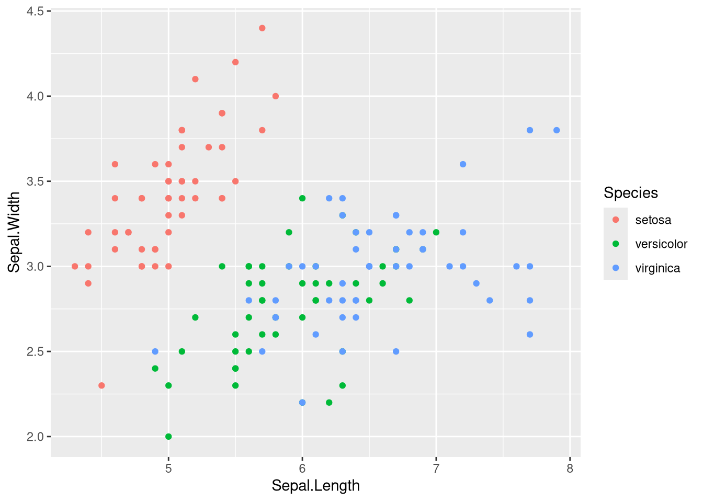
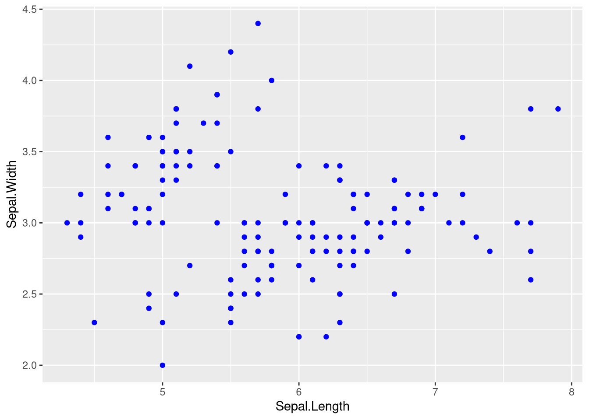

# ggplot2 - Mappage ou attribut fixe

La règle à retenir pour savoir où placer une couleur, une taille ou une forme.

## La règle

Pour relier un attribut graphique aux valeurs d'une variable, on le déclare dans `aes()`. Pour fixer un attribut de la même manière partout, on le définit en dehors de `aes()`.

## Mappage dans aes

La couleur dépend de la variable `Species`, ggplot2 crée une légende.

```r
ggplot(data = iris, aes(x = Sepal.Length, y = Sepal.Width, color = Species)) +
   geom_point()
```



## Attribut fixe hors aes

Tous les points sont bleus, il n'y a aucune légende puisque aucune variable n'est en jeu.

```r
ggplot(data = iris, aes(x = Sepal.Length, y = Sepal.Width)) +
   geom_point(color = "blue")
```



## Récapitulatif

| Attribut | Dans aes | Hors aes |
| --- | --- | --- |
| `color` | couleur de tracé liée à une variable, légende automatique | `color = "blue"`, même couleur de tracé partout |
| `fill` | couleur de remplissage liée à une variable | `fill = "white"`, même remplissage partout |
| `size` | taille liée à une variable quantitative | `size = 2`, même taille partout |
| `shape` | forme liée à une variable qualitative | `shape = 17`, même forme partout |
| `alpha` | transparence liée à une variable | `alpha = 0.2`, même transparence partout |
| `linetype` | type de trait lié à une variable | `linetype = "dashed"`, même trait partout |

## Erreur classique

Écrire `aes(color = "blue")` ne colore pas en bleu. ggplot2 comprend qu'il existe une variable constante valant la chaîne `"blue"`, il choisit lui-même une couleur et ajoute une légende inutile.

## Voir aussi

- [ggplot2 - Grammaire de base](ggplot2%20-%20Grammaire%20de%20base.md)
- [ggplot2 - Catalogue des geom](ggplot2%20-%20Catalogue%20des%20geom.md)
- [ggplot2 - Scales et axes](ggplot2%20-%20Scales%20et%20axes.md)
- [Dataviz - Quel graphique pour quel type de variable](Dataviz%20-%20Quel%20graphique%20pour%20quel%20type%20de%20variable.md)
