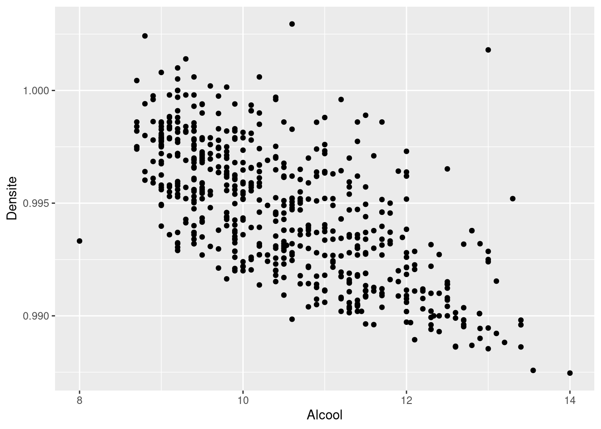
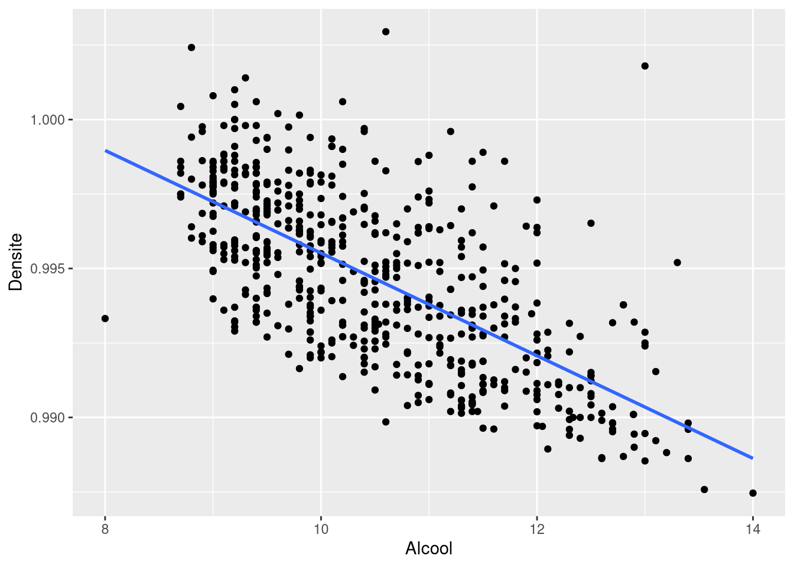

# ggplot2 - Nuage de points et régression

Regarder la liaison entre deux variables quantitatives et y ajuster une droite.

## Le nuage de points

On représente les points de coordonnées $(x_i, y_i)$.

```r
ggplot(Data, aes(x = Alcool, y = Densite)) +
  geom_point()
```



## La droite d'ajustement

```r
ggplot(Data, aes(x = Alcool, y = Densite)) +
  geom_point() +
  geom_smooth(method = lm, se = FALSE)
```



| Argument | Effet |
| --- | --- |
| `method = lm` | ajuste une droite de régression linéaire |
| `method = "loess"` | ajuste une courbe lissée localement, sans hypothèse de linéarité |
| `se` | `TRUE` affiche la bande de confiance autour de l'ajustement, `FALSE` la supprime |
| `formula` | la formule du modèle, par exemple `y ~ x` ou `y ~ poly(x, 2)` |
| `level` | niveau de confiance de la bande, 0.95 par défaut |

## Lecture avec la corrélation

Le coefficient de corrélation linéaire donne le signe et la force de la liaison, et il appartient à $[-1, 1]$.

```r
cor(Data$Densite, Data$Alcool)
```

Ici la corrélation est fortement négative, le nuage s'aligne sur une droite de pente négative. Plus l'alcool est élevé, plus la densité est faible. Une corrélation proche de 0 signifie qu'aucune droite ne résume le nuage, et la droite tracée par `geom_smooth()` serait alors trompeuse.

## Voir aussi

- [Stats - Covariance et corrélation](Stats%20-%20Covariance%20et%20corr%C3%A9lation.md)
- [ggplot2 - Grammaire de base](ggplot2%20-%20Grammaire%20de%20base.md)
- [ggplot2 - Catalogue des geom](ggplot2%20-%20Catalogue%20des%20geom.md)
- [ggplot2 - Mappage ou attribut fixe](ggplot2%20-%20Mappage%20ou%20attribut%20fixe.md)
- [Dataviz - Quel graphique pour quel type de variable](Dataviz%20-%20Quel%20graphique%20pour%20quel%20type%20de%20variable.md)
- [Dataviz - Démarche d'exploration d'un jeu de données](Dataviz%20-%20D%C3%A9marche%20d%27exploration%20d%27un%20jeu%20de%20donn%C3%A9es.md)
