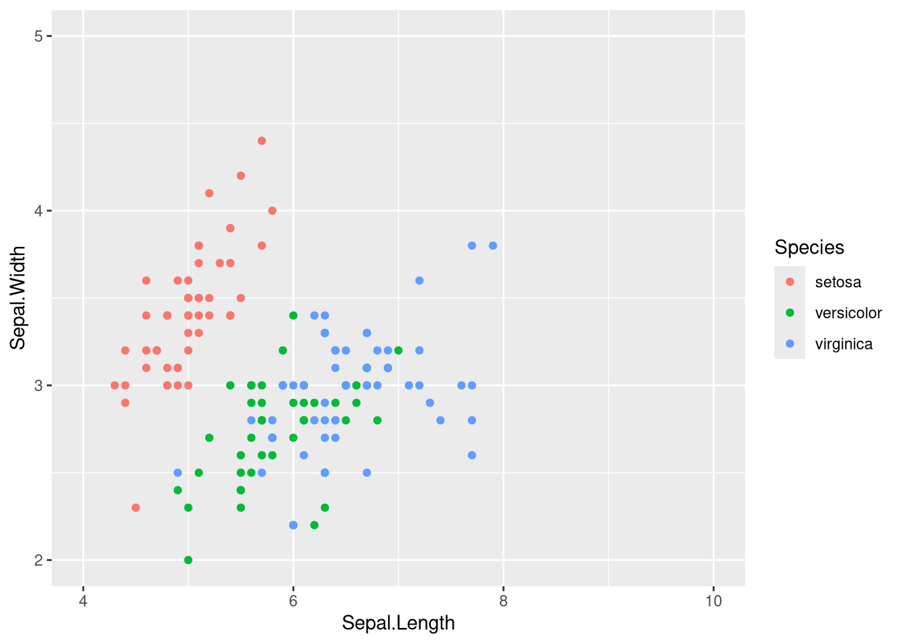

# ggplot2 - Scales et axes

Régler la façon dont un attribut graphique est lié aux valeurs d'une variable.

## La convention de nommage

Toutes ces fonctions s'écrivent `scale_<attribut>_<type>` et s'ajoutent avec `+`. L'attribut est `x`, `y`, `color`, `fill`, `size`, le type précise la nature de la variable ou la palette voulue.

| Fonction | Effet |
| --- | --- |
| `scale_size(range =, breaks =)` | tailles minimale et maximale, et graduations de la légende |
| `scale_x_continuous(name, limits =, breaks =)` | axe des x pour une variable quantitative |
| `scale_x_discrete()` | axe des x pour une variable qualitative |
| `scale_y_continuous()` | axe des y pour une variable quantitative |
| `scale_y_discrete()` | axe des y pour une variable qualitative |
| `scale_color_manual(values =)` | palette de couleurs de tracé choisie à la main |
| `scale_color_gradient(low =, high =)` | dégradé continu entre deux couleurs |
| `scale_color_brewer(palette =)` | palette prédéfinie de ColorBrewer |
| `scale_color_viridis()` | palette viridis, lisible en niveaux de gris |
| `scale_fill_*` | mêmes variantes pour la couleur de remplissage |

## Continuous ou discrete

On utilise `continuous` quand la variable mappée est quantitative et `discrete` quand elle est qualitative. Une variable qualitative codée en chiffres doit donc passer par `as.factor()` avant, sinon ggplot2 la traitera comme continue.

## color ou fill

`color` est la couleur de tracé, celle des points, des lignes et du contour des formes. `fill` est la couleur de remplissage, celle de l'intérieur des barres, des boîtes et des violons.

## Raccourcis

| Fonction | Effet |
| --- | --- |
| `ggtitle("...")` | titre du graphique |
| `xlab("...")` | intitulé de l'axe des abscisses |
| `ylab("...")` | intitulé de l'axe des ordonnées |
| `ylim(a, b)` | bornes de l'axe des ordonnées |

## Exemple complet

Tel quel, le `scale_size()` de cet exemple du TP ne fait rien : aucune variable n'est mappée sur `size` dans `aes()`.

```r
ggplot(data = iris, aes(x = Sepal.Length, y = Sepal.Width, color = Species)) +
  geom_point() +
  scale_size("Petal.Length", range = c(1, 7), breaks = seq(0, 7, 0.5)) +
  scale_x_continuous("Sepal.Length", limits = c(4, 10)) +
  scale_y_continuous("Sepal.Width", limits = c(2, 5))
```



Le premier argument de `scale_x_continuous()` est le nom affiché sur l'axe, `limits` fixe les bornes et `breaks` les graduations.

## Voir aussi

- [ggplot2 - Grammaire de base](ggplot2%20-%20Grammaire%20de%20base.md)
- [ggplot2 - Mappage ou attribut fixe](ggplot2%20-%20Mappage%20ou%20attribut%20fixe.md)
- [ggplot2 - Catalogue des geom](ggplot2%20-%20Catalogue%20des%20geom.md)
- [ggplot2 - Assembler plusieurs graphiques](ggplot2%20-%20Assembler%20plusieurs%20graphiques.md)
